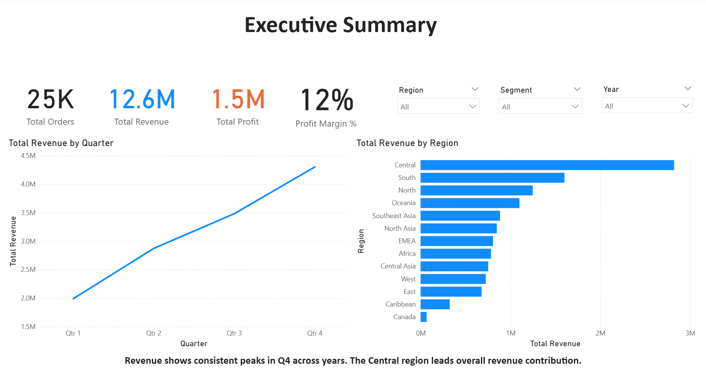
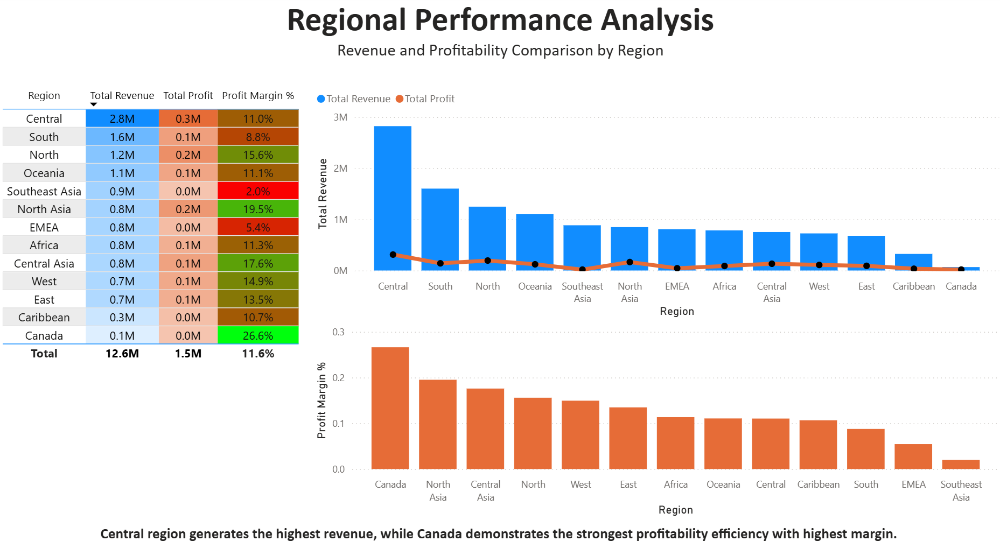
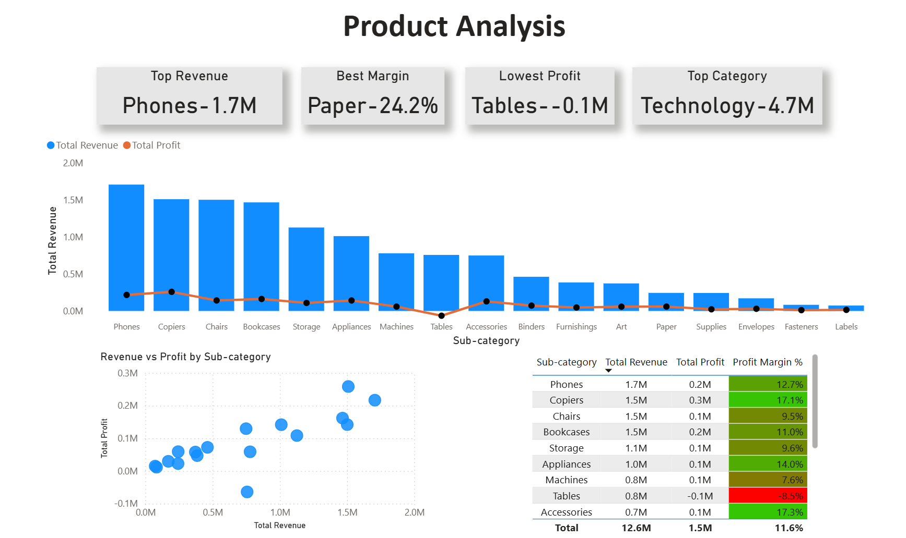

# Sales Performance Dashboard- Power BI

## Project Overview
This project presents an interactive dashboard built in Microsoft Power BI to analyze sales performance, profitability, and product-level insights using the SuperStoreOrders.csv dataset.
The goal of this project is to provide a clear overview of business performance and highlight important insights related to revenue, profit, and product contribution.

## Dataset
The dataset used in this project is the SuperStoreOrders dataset which contains transactional sales information including:
- Order Date
- Sales
- Profit
- Category
- Sub-category
- Product Name
- Region

The dataset was imported into Power BI and used for analysis and visualization.

## Dashboard Pages

### 1. Executive Summary
This page provides a overview of overall business performance.

Visualizations include:
- KPI cards showing Total Orders, Total Revenue, Total Profit, and Profit Margin
- Sales trend analysis overtime.
- segment-wise revenue contribution

This page helps quickly understand the overall business performance.

### 2. Regional Performance Analysis
This page focuses on analyzing sales and profitability across different regions.

Visualizations include:
- Revenue vs Profit comparison by region
- Profit analysis across regions
- Profit margin comparison by region

This page helps identify which regions contribute most revenue and profitability.

### 3. Product Analysis
This page focuses on product and sub-category level performance.

Visualizations include:
- KPI indicators highlighting top and lowest performing products
- Revenue vs Profit comparison by sub-category
- Scatter plot showing relationship between revenue and profit
- Table showing profit margin by sub-category product

This page helps identify high-performing products and areas with lower profitability.

## Tools Used

- Micosoft Power BI
- DAX
- Data Visualization Techniques

## Project Files
- Power BI dashboard file- Superstore Data Analysis.pbix
- Dataset used in this project- SuperStoreOrders.csv
- Dashboard preview images

## Project Objective
The objective of this project is to demonstrate the ability to:
- Build interactive dashboard in Power BI
- Analyze business performance using data
- Present insights using data visualization

## Dashboard Previews

### 1. Executive Summary

### 2. Regional Performance Analysis

### 3. Product Analysis

